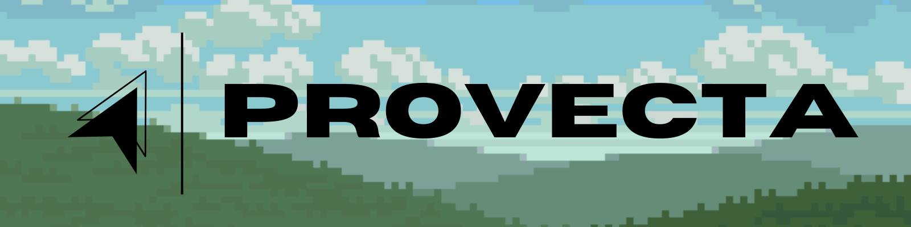

Provecta is a small, minimal experiment in building an **HTMX + WebSocket-driven UI framework in Python**, written out of both curiosity and a healthy aversion to JS.

This project is intentionally tiny, toy-ish, and educational: something between a tech demo, a playground for architectural ideas, and a portfolio-friendly showcase of clean modular design.

## ✨ Features

- **Declarative UI tree** built on Python classes
- **Reactive events** with bubbling included
- **Zero page-reload interactions** powered by HTMX and WebSockets
- **Tiny VDOM renderer** that morphs DOM nodes via idiomorph
- **A simple app structure** demonstrating routing via state updates
- **Hot-reload friendly server** using Starlette and Uvicorn
- **TailwindCSS** support via CDN for quick styling

## 🚀 How it Works

Provecta renders a Python-defined element tree into HTML, and sends it to the browser through the established WebSocket.

When an event is received, we:
1. Locate the triggering element using an ID store.
2. Route the event to it, bubbling if necessary.
3. Compute morph-friendly changes to the DOM based on the ```EventResult```
4. Render and send said changes via WebSocket, resulting in a page update using HTMX's out-of-band swaps.

The browser only has to render HTML and fire events, keeping the frontend pleasantly lightweight.

## 🔎 Examples
Have a look for yourself in the [examples folder](examples/)
